## Approach to equilibrium

Представим что в коробке есть определенное количество частиц, есть перегородка и проделана дырка в этой перегородке. Дырка такая, что через нее может пройти только одна случайная частица. Каждую итерацию, частица обязательно проходит через дырку. В данном проекте проделирована именно эта ситуация.

Цель проекта: промоделировать и визуализировать данную ситуацию и провести анализ. 
Для этого реалихзованы следующие скрипты:

* `script_1.py` - модель эволюции нашей системы
* `script_2.py` - модель эволюции нашей системы с немного измененными условиями

Директории:
* create_datasets - директория для запуска экспериментов
    * `main.py` - запускает все эксперименты описанные в `stable_equlibrium.py` `unstable_stable_equlibrium.py`.
    * `stable_equlibrium.py` - запускает два скрипта, заданное количество раз, на заданное условие стабильности.
    * `unstable_stable_equlibrium.py` - запускает два скрипта, заданное количество раз, до первого столкновения с равенством частиц справа и слева.
    * `script_1_errors.py` - скрипт, для запуска определенное `script_1.py` количество раз, на заданное количество условий, разное количество частиц, и для создания датасета.
    * `script_2_errors.py` - тоже самое, что и `experiment_danny_error.py`, толкьо для `update_approach_to_equilibrium.py`.
* create_graphic - директория для составления графиков, по созданным датасетам в формате `.csv`
    * `graphic.py` - строит по оси ординат - количество шагов, которые находяться в ячейках `.csv`, по оси абсцисс - строка из файла. Строит коиличество графиков равное количеству столбцов.
    * `histogram.py` - ординат - как часто встречается значение, по оси абсцисс - ячейки.
    * `normal_distribution.py` - аппроксимирует данные и строит нормальное распределение.
* test_normal - директория с тестами, соответствуют ли данные нормальному распределению:
    * `test_anderson_darling.py` - тест Андерсона-Дарлинга.
    * `test_kolmogorov_smirnov.py` - тест Колмогорова-Смирнова.
    * `test_shapiro_uilk.py` - тест Шапиро-Уилка.

## Скрипт approach_to_equilibrium.py

В скрипте `approach_to_equilibrium.py` была промоделирована ситуация, для анализа равновесия системы, при котором частицы движутся хаотично, по координатам $x, y$. Логика изменения их координат находится в методе `step()` класса `Box`.

###  Неустойчивое равновесие системы

Неустойчивое равновесие - состояние системы, на котороткий промежуток итераций (в данном случае 1), сохраняет свое состояние. Я выбрал состояние, при котором количество слева частиц, равно количеству справа.

Для вычисления количества шагов, в котором система сразу переходит в неустойчивое равновесие, я написал скрипт `unstanle_equlibrium_results.py`, который проводит эксперименты, в задаваемом количестве раз и записывает количество шагов в таблицу.

<!-- не соотвествуют, так как уровень значимости данных при нормальном распределении в основном менье 0.05 -->
<!-- После из таблицы подсчитываются данные, для оценкии нормального распределения:

*  среднее значение шагов

$$ \bar{x} = \frac{1}{n}\sum_{i=1}^{n}x_i $$

*  стандартное отклонение

$$ \sigma = \sqrt {\frac{{\sum_{i=1}^{n}(x_i-\bar{x})}}{{n}}} $$

*  стандартную ошибку (абсолютная погрешность среднего значения)

$$ d = \frac{\sigma}{\sqrt{n}} $$

*  погрешность с доверительным интервалом
$$ \dot{x} = \bar{x} \pm k * d $$ 
$k$ - коэффициент, соответствующий уровню доверия (например, для уровня доверия 95% $k = 1.96$

* Результаты достижения неустойчивого равновесия, при провердении 1000 экспериментов:
    * 8 частиц: $6.358 \pm 0.096 * 0.1899$. Погрешность - $0.23$ % 
    * 16 частиц: $16.432 \pm 0.250 * 0.490$ Погрешность - $0.74$ % 
    * 64 частиц: $88.452 \pm 1.120 * 2.195$ Погрешность - $2.78$ % 
    * 400 частиц: $728.320 \pm 6.968 * 13.658$ Погрешность - $13.07$ %
    * 800 частиц: $1581.870 \pm 14.148 * 27.731$ Погрешность - $24.8$ % 
    * 3600 частиц: $8640.204 \pm 67.389 * 132.082$ Погрешность > $100$ % 

Так как погрешность огромна из на нехватки и большого разброса случаев с большим количеством частиц значений, проведем еще 100000 эксперементов.

* Резуьтаты при датасете с 100000 количеством данных для каждой частицы:
    * 8 частиц: $6.7126 \pm 0.011 * 0.022$. Погрешность < $0.01$ % 
    * 16 частиц: $16.148 \pm 0.0246 * 0.048$ Погрешность < $0.01$ % 
    * 64 частиц: $86.699 \pm 0.108 * 0.211$ Погрешность - $0.03$ % 
    * 400 частиц: $726.060 \pm 0.696 * 1.365$ Погрешность - $0.13$ %
    * 800 частиц: $1591.284 \pm 1.405 * 2.754$ Погрешность - $0.24$ % 
    * 3600 частиц: $8512.508\pm 6.278 * 12.304$ Погрешность - $0.91$ %

При увеличении количества экспериментов в 100 раз, погрешность уменьшилась в 100 раз. -->

Формулы для вычисления:

*  среднее значение шагов

$$ \bar{x} = \frac{1}{n}\sum_{i=1}^{n}x_i $$

*  стандартное отклонение

$$ \sigma = \sqrt {\frac{{\sum_{i=1}^{n}(x_i-\bar{x})}}{{n}}} $$

*  стандартную ошибку (абсолютная погрешность среднего значения)

$$ d = \frac{\sigma}{\sqrt{n}} $$

* для оценки доверительного интервала использовался метод [`bootstrap`](https://habr.com/ru/companies/X5Tech/articles/679842/).
Данные у меня не соотвествуют номральному распределиню по тесту [Шапиро-Уилка](https://tvims.nsu.ru/arkashov/calc/Stat/Shapiro/Shapiro.html)

Для данных 1000 экспериментов (bootstrap с 1000 итерациями)

| Количество частиц | Среднее значение количество шагов| Доверительный интервал |
|--------------------|------------------|------------------------|
| 8                  | 6.358            | 6.1699 - 6.554          |
| 16                 | 16.432           | 15.962 - 16.94805       |
| 64                 | 88.452           | 86.3599 - 90.79065      |
| 400                | 728.32           | 714.51905 - 742.80135   |
| 800                | 1581.87          | 1555.8736 - 1608.54805  |
| 3600               | 8640.204         | 8496.6417 - 8769.6123   |

Для данных 100000 экспериментов (bootstrap с 1000 итерациями)

| Количество частиц | Среднее значение количество шагов | Доверительный интервал |
|--------------------|------------------|------------------------|
| 8                  | 6.7126           | 6.6919 - 6.7352        |
| 16                 | 16.148           | 16.1024 - 16.1969      |
| 64                 | 86.6986          | 86.4876 - 86.9186      |
| 400                | 726.0597         | 724.7265 - 727.5185    |
| 800                | 1591.2842        | 1588.6214 - 1593.8990  |
| 3600               | 8512.5080        | 8500.0326 - 8524.6717  |

График для данных 1000 экспериментов (bootstrap с 1000 итерациями)
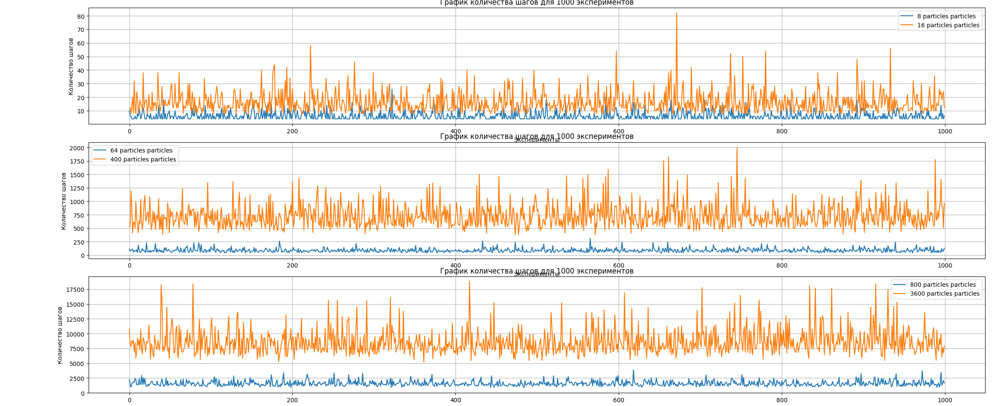

Гистограмма для данных 1000 экспериментов (bootstrap с 1000 итерациями)
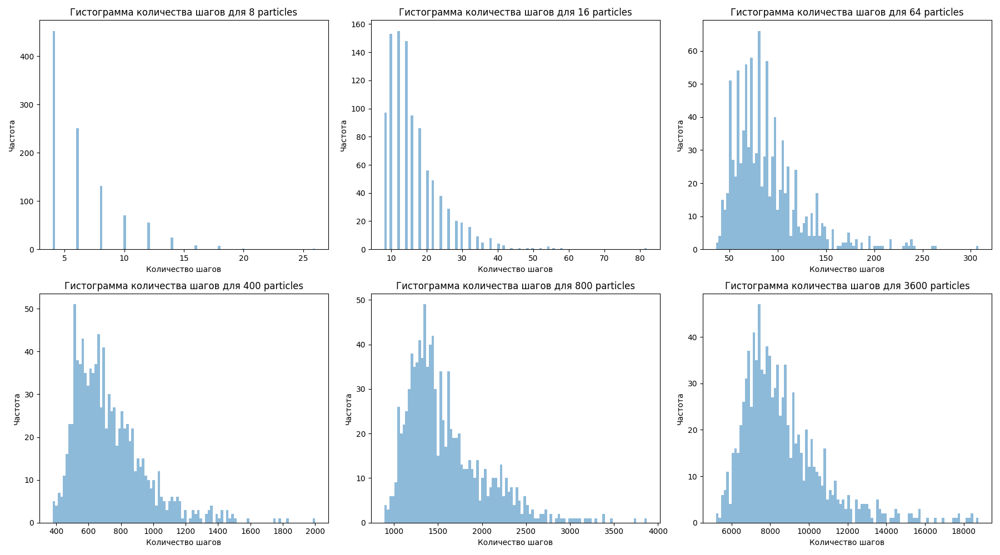

Гистограмма для данных 100000 экспериментов (bootstrap с 1000 итерациями)
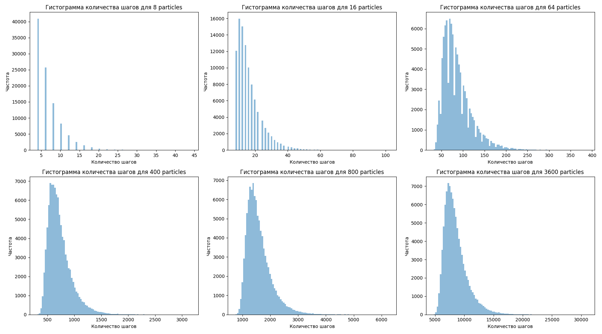

### Графики достижения одного результата неустойчивого равновесия 

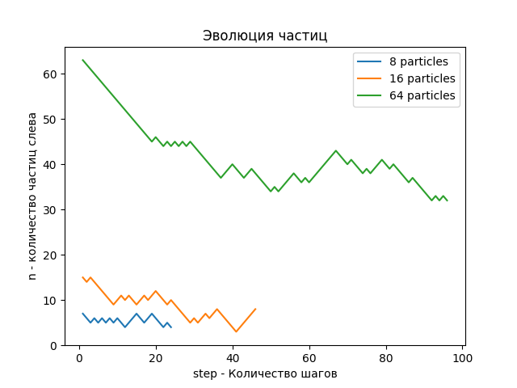
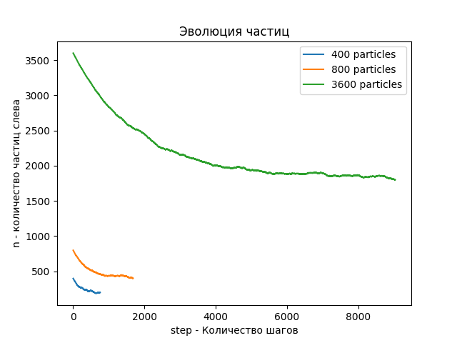

### Вывод для неустойчивого равновесия

Найденны средние значения шагов, для достижения неусточивого равновесия системы. 
С увеличением количества частиц, увеличивается количество итерация для достижения результата.

### Устойчивая стабильность системы

В качестве устойчивого равновесия я выбрал условие при котором текущее значение $\pm 1$ частиц в середине, сохраняется в течение определенного количества итераций.

Устойчивые значения в течение 10 шагов:

Для данных 1000 экспериментов (bootstrap с 1000 итерациями)

| Количество частиц | Среднее значение количество шагов| Доверительный интервал |
|--------------------|------------------|------------------------|
| 8                  | 24.837           | 23.83595 - 25.82505     |
| 16                 | 32.709           | 31.495 - 34.07335       |
| 64                 | 57.235           | 55.65185 - 58.937425    |
| 400                | 158.791          | 155.22055 - 162.43575   |
| 800                | 249.362          | 244.2508 - 254.857825   |
| 3600               | 697.142          | 685.26035 - 710.178575  |

Для данных 100000 экспериментов (bootstrap с 1000 итерациями)

| Количество частиц | Среднее значение количество шагов | Доверительный интервал |
|--------------------|------------------|------------------------|
| 8                  | 25.0029          | 24.903683 - 25.101311   |
| 16                 | 33.53598         | 33.404975 - 33.66478575 |
| 64                 | 57.5199          | 57.34336275 - 57.6895 |
| 400                | 158.01831        | 157.69739475 - 158.350 |
| 800                | 247.45617        | 246.945405 - 247.965 |
| 3600               | 709.84629        | 708.62695925 - 711.189 |

Устойчивые значения в течение 15 шагов:

Для данных 1000 экспериментов (bootstrap с 1000 итерациями)

| Количество частиц | Среднее значение количество шагов| Доверительный интервал |
|--------------------|------------------|------------------------|
| 8                  | 25.292           | 24.286 - 26.290 |
| 16                 | 33.396           | 32.109 - 34.721       |
| 64                 | 56.689           | 55.126 - 58.523     |
| 400                | 157.057          | 153.8830 - 160.661 |
| 800                | 242.719          | 238.103 - 248.141  |
| 3600               | 722.615          | 709.109 - 735.958  |

Для данных 100000 экспериментов (bootstrap с 1000 итерациями)

| Количество частиц | Среднее значение количество шагов | Доверительный интервал |
|--------------------|------------------|------------------------|
| 8                  | 25.05636          | 24.958 - 25.148
| 16                 | 33.44129         | 33.318 - 33.574  |
| 64                 | 57.58838          | 57.4012 - 57.771 |
| 400                | 157.54303       | 157.183- 157.897 |
| 800                | 247.67283        | 247.168 - 248.194  |
| 3600               | 705.59859       | 704.3545 - 706.958 |

График для данных 1000 экспериментов (bootstrap с 1000 итерациями)
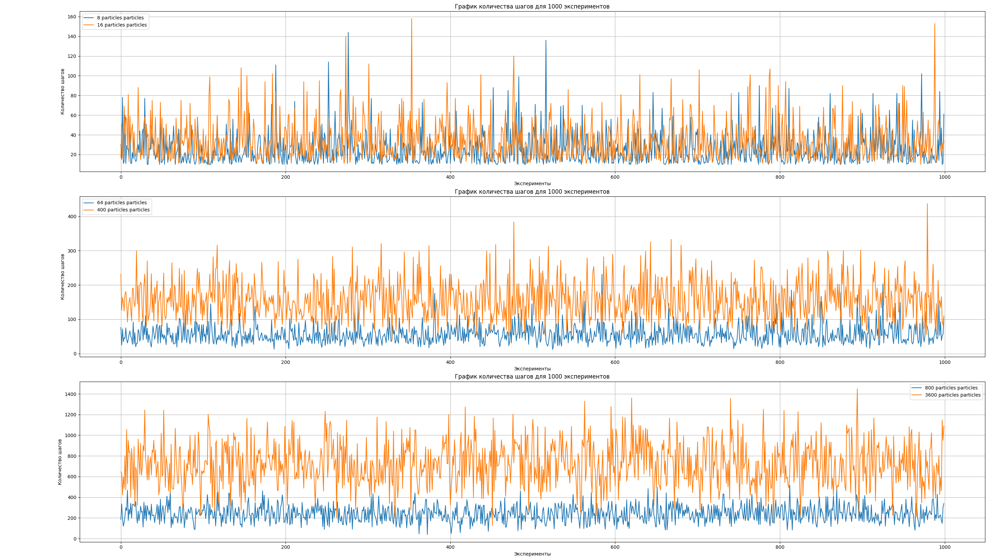

Гистограмма для данных 1000 экспериментов (bootstrap с 1000 итерациями)
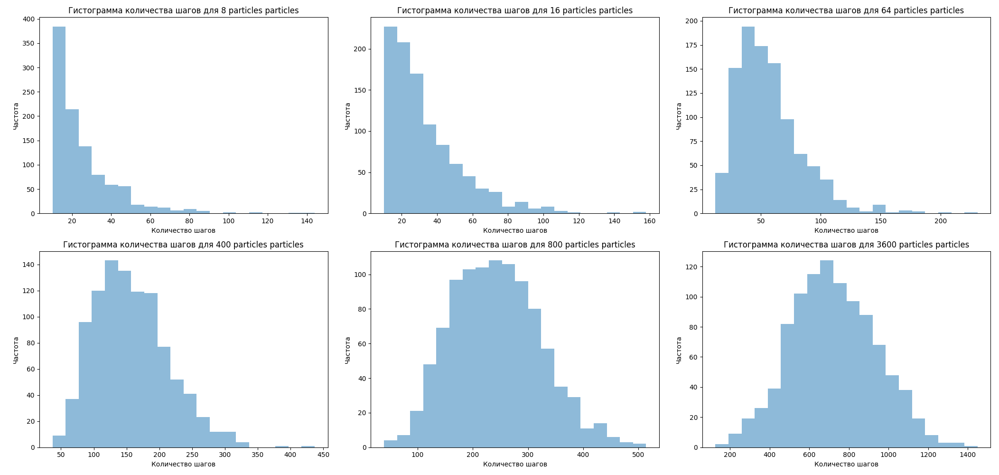

Гистограмма для данных 100000 экспериментов (bootstrap с 1000 итерациями)
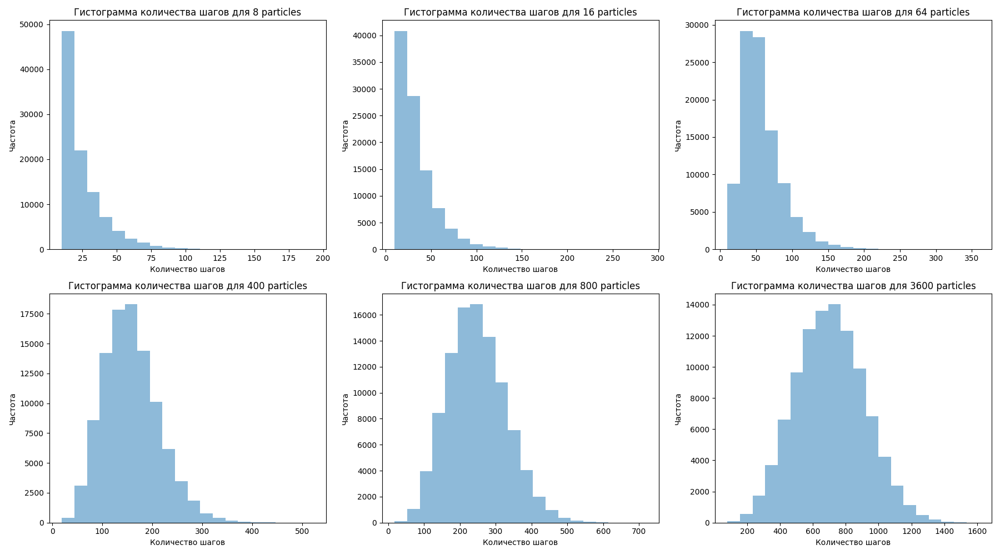

### Вывод для стабильности системы

* Система не сможет достичь постоянного устойчивого равновесия, только при условии, что устойчивость сохраняется на протяжение нескольких итераций, без погрешности в данной модели.

* При увеличение итераций, увеличивается и необходимое количество итераций. 

<!-- * Удалось найти c вероятность 95% истинные значения параметров при большом количестве экспериментов -->

<!-- Система не сможет достичь устройчивого равновесия (равновесие сохраняется более одной), так как в модели скрипта, лежит условие, что при каждом шаге, всегда одна частица будет менять свое местоположение.

При попытке поставить стабильное равновесие(критерий - сохранять равновесие с погрешностью, в течение определенного количества шагов) были выведены противоречивые результаты, в результате которых надо было бы менять модель, что с каждым шагом, менять бы значения всех координат рандомно в у оси абсцисс пределах от 0 до 1. 
Когда система сохраняла свое равновесие в пределах погрешности 20%, в течение определенного количества итераций - модель с большим количеством частиц, требовала большее количества итераций.(Погрешность(допустимый диапазон частиц растет, а количество шагов за итерацию - нет). -->

## Устойчивое равновесие системы.

Устойчивое рановесие системы в данной модели невозможно, так как каждый раз частица обязана перескочить через отверстие. Если взять погрешность от среднего значения частиц, то устойчивость можно достигнуть, но учитывая, что за итерацию проходит одна случайная частица - устойчивость при значительном количестве частиц будет досигнута при первых итерациях. 
Если брать состояние системы $\pm$ 1 частица, потребуется очень большое количество мощностей, для получение огромного количества датасета. Если взять малое количество экспериментов, аппроксимайия данных будет достаточно слабой.

## Скрипт update_approach_to_equilibrium.py

Реализована та же ситуация но только условие перехода на левую сторону равно $r < p = n/N$ $r$ - случайное число от 0 до 1, $n$ - количество частиц слева $N$ - количество частиц всего.

Спрособы подсчета были точно такие же как и сверху.

## Неустойчивое равновесие update_approach_to_equilibrium.py

Для данных 1000 экспериментов (bootstrap с 1000 итерациями)

| Количество частиц | Среднее значение количества шагов | Доверительный интервал |
|--------------------|----------------------------------|------------------------|
| 8                  | 6.684                            | 6.48 - 6.900            |
| 16                 | 15.868                           | 15.382 - 16.358         |
| 64                 | 87.946                           | 85.864 - 90.175         |
| 400                | 727.804                          | 715.061 - 741.491       |
| 800                | 1610.92                          | 1583.022 - 1638.702     |
| 3600               | 8485.76                          | 8359.091 - 8603.525     |

Для данных 100000 экспериментов (bootstrap с 1000 итерациями)

| Количество частиц | Среднее значение количества шагов | Доверительный интервал |
|--------------------|----------------------------------|------------------------|
| 8                  | 6.707                            | 6.669 - 6.744           |
| 16                 | 16.117                           | 16.032 - 16.206         |
| 64                 | 86.992                           | 86.611 - 87.399         |
| 400                | 726.331                          | 723.938 - 728.823       |
| 800                | 1588.955                         | 1584.017 - 1593.657     |
| 3600               | 8529.795                         | 8505.904 - 8550.978     |

График для данных 1000 экспериментов (bootstrap с 1000 итерациями)
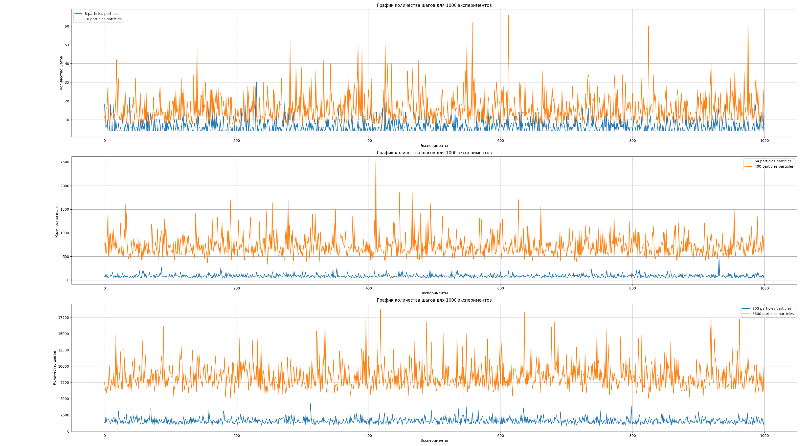

Гистограмма для данных 1000 экспериментов (bootstrap с 1000 итерациями)
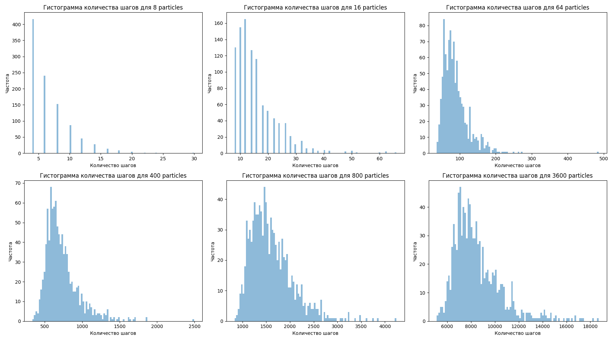

Гистограмма для данных 100000 экспериментов (bootstrap с 1000 итерациями)
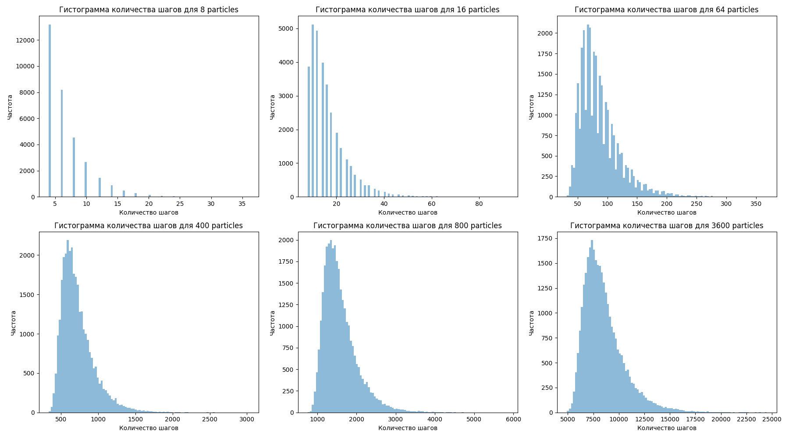

### Графики достижения одного результата неустойчивого равновесия 

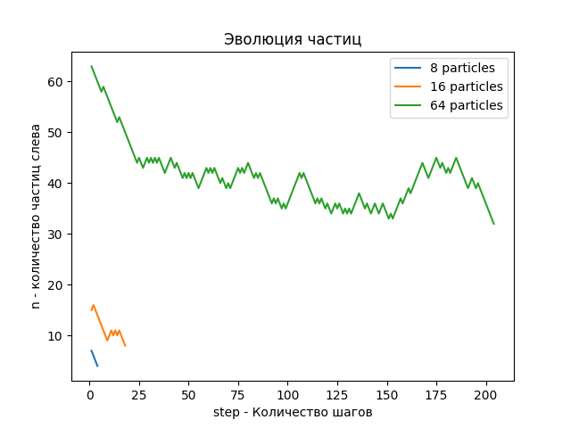
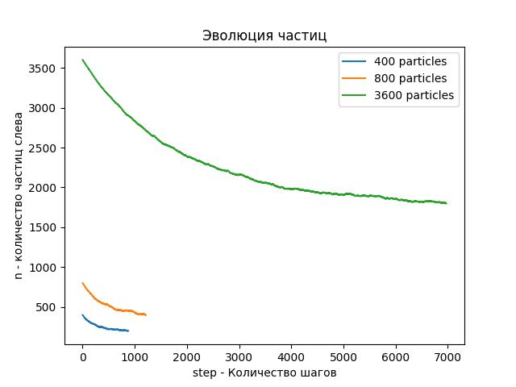

Устойчивые значения в течение 15 шагов:

### Устойчивая стабильность системы равновесие update_approach_to_equilibrium.py

Устойчивые значения в течение 10 шагов:

Для данных 1000 экспериментов (bootstrap с 1000 итерациями)

| Количество частиц | Среднее значение количества шагов | Доверительный интервал |
|--------------------|----------------------------------|------------------------|
| 8                  | 24.342                           | 23.399 - 25.301         |
| 16                 | 33.303                           | 32.034 - 34.581         |
| 64                 | 60.331                           | 58.374 - 62.256         |
| 400                | 160.073                          | 156.494 - 163.407       |
| 800                | 245.249                          | 240.451 - 250.484       |
| 3600               | 709.713                          | 696.304 - 722.545       |

Для данных 100000 экспериментов (bootstrap с 1000 итерациями)

| Количество частиц | Среднее значение количества шагов | Доверительный интервал |
|--------------------|----------------------------------|------------------------|
| 8                  | 25.031                           | 24.929 - 25.140         |
| 16                 | 33.416                           | 33.286 - 33.540         |
| 64                 | 57.510                           | 57.327 - 57.702         |
| 400                | 157.506                          | 157.158 - 157.839       |
| 800                | 247.752                          | 247.271 - 248.267       |
| 3600               | 707.621                          | 706.356 - 708.907       |

Устойчивые значения в течение 15 шагов:

Для данных 1000 экспериментов (bootstrap с 1000 итерациями)

| Количество частиц | Среднее значение количества шагов | Доверительный интервал |
|--------------------|----------------------------------|------------------------|
| 8                  | 111.644                          | 105.869 - 117.391       |
| 16                 | 177.920                          | 167.865 - 188.060       |
| 64                 | 257.288                          | 243.613 - 271.238       |
| 400                | 473.383                          | 457.635 - 489.590       |
| 800                | 668.298                          | 648.533 - 687.570       |
| 3600               | 1796.376                         | 1761.648 - 1829.830     |

Для данных 100000 экспериментов (bootstrap с 1000 итерациями)

| Количество частиц | Среднее значение количества шагов | Доверительный интервал |
|--------------------|----------------------------------|------------------------|
| 8                  | 111.927                          | 111.357 - 112.482       |
| 16                 | 177.435                          | 176.495 - 178.443       |
| 64                 | 271.418                          | 269.965 - 272.845       |
| 400                | 478.408                          | 476.751 - 480.007       |
| 800                | 677.176                          | 675.290 - 679.049       |
| 3600               | 1779.612                         | 1776.210 - 1782.872     |
