## Approach to equilibrium

Представим что в коробке есть определенное количество частиц, есть перегородка и проделана дырка в этой перегородке. Дырка такая, что через нее может пройти только одна случайная частица. Каждую итерацию, частица обязательно проходит через дырку. В данном проекте проделирована именно эта ситуация.

Цель проекта: промоделировать и визуализировать данную ситуацию и провести анализ. 

Для этого реалихзованы следующие скрипты:
<!-- 
* `script_1.py` - модель эволюции нашей системы
* `script_2.py` - модель эволюции нашей системы с немного измененными условиями

Директории:
* create_datasets - директория для запуска экспериментов
    * `main.py` - запускает все эксперименты описанные в `stable_equlibrium.py` `unstable_stable_equlibrium.py`.
    * `stable_equlibrium.py` - запускает два скрипта, заданное количество раз, на заданное условие стабильности.
    * `unstable_stable_equlibrium.py` - запускает два скрипта, заданное количество раз, до первого столкновения с равенством частиц справа и слева.
    * `script_1_errors.py` - скрипт, для запуска определенное `script_1.py` количество раз, на заданное количество условий, разное количество частиц, и для создания датасета.
    * `script_2_errors.py` - тоже самое, что и `experiment_danny_error.py`, толкьо для `update_approach_to_equilibrium.py`.
* create_graphic - директория для составления графиков, по созданным датасетам в формате `.csv`
    * `graphic.py` - строит по оси ординат - количество шагов, которые находяться в ячейках `.csv`, по оси абсцисс - строка из файла. Строит коиличество графиков равное количеству столбцов.
    * `histogram.py` - ординат - как часто встречается значение, по оси абсцисс - ячейки.
    * `normal_distribution.py` - аппроксимирует данные и строит нормальное распределение.
* test_normal - директория с тестами, соответствуют ли данные нормальному распределению:
    * `test_anderson_darling.py` - тест Андерсона-Дарлинга.
    * `test_kolmogorov_smirnov.py` - тест Колмогорова-Смирнова.
    * `test_shapiro_uilk.py` - тест Шапиро-Уилка.
 -->

## script_1.py

В скрипте `script_1.py` была промоделирована ситуация, для анализа равновесия системы, при котором частицы движутся хаотично, по координатам $x, y$. Логика изменения их координат находится в методе `step()` класса `Box`.

###  Неустойчивое равновесие системы script_1.py

Неустойчивое равновесие - состояние системы, на котороткий промежуток итераций (в данном случае 1), сохраняет свое состояние. Я выбрал состояние, при котором количество слева частиц, равно количеству справа.

Для вычисления количества шагов, в котором система сразу переходит в неустойчивое равновесие, я написал скрипт `unstable_equlibrium_results.py`, который проводит эксперименты, в задаваемом количестве раз и записывает количество шагов в таблицу.

Формулы для вычисления:

*  среднее значение шагов

$$ \bar{x} = \frac{1}{n}\sum_{i=1}^{n}x_i $$

*  стандартное отклонение

$$ \sigma = \sqrt {\frac{{\sum_{i=1}^{n}(x_i-\bar{x})}}{{n}}} $$

*  стандартную ошибку (абсолютная погрешность среднего значения)

$$ d = \frac{\sigma}{\sqrt{n}} $$

* для оценки доверительного интервала использовался метод [`bootstrap`](https://habr.com/ru/companies/X5Tech/articles/679842/).
Данные у меня не соотвествуют номральному распределиню по тесту [Шапиро-Уилка](https://tvims.nsu.ru/arkashov/calc/Stat/Shapiro/Shapiro.html)

### Результаты экспериментов script_1.py

Данные находятсья в директории datasets/approach_to_equilibrium

* Результаты полученные при проведение эксперимента 1000 раз

| Количество частиц | Среднее значение количество шагов | Доверительный интервал |
|-------------------|-----------------------------------|------------------------|
| 8                 | 6.692                             | 6.494 - 6.914          |
| 16                | 16.312                            | 15.824 - 16.828        |
| 64                | 87.442                            | 85.302 - 89.698        |
| 400               | 723.752                           | 709.651 - 736.649      |
| 800               | 1591.222                          | 1564.354 - 1618.235    |
| 3600              | 8500.682                          | 8372.004 - 8627.719    |

* Результаты полученные при проведение эксперимента 10000 раз

| Количество частиц | Среднее значение количество шагов | Доверительный интервал |
|-------------------|-----------------------------------|------------------------|
| 8                 | 6.743                             | 6.675 - 6.812          |
| 16                | 16.286                            | 16.129 - 16.450        |
| 64                | 87.441                            | 86.798 - 88.141        |
| 400               | 724.528                           | 720.227 - 728.353      |
| 800               | 1591.333                          | 1582.916 - 1599.787    |
| 3600              | 8504.902                          | 8466.005 - 8543.424    |

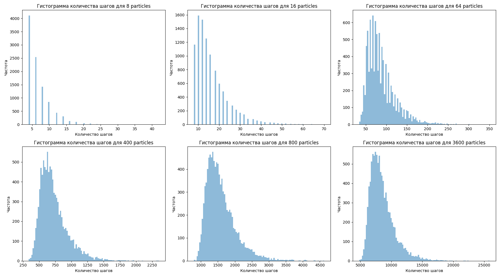

* Результаты полученные при проведение эксперимента 100000 раз

| Количество частиц | Среднее значение количество шагов | Доверительный интервал |
|-------------------|-----------------------------------|------------------------|
| 8                 | 6.705                             | 6.683 - 6.728          |
| 16                | 16.174                            | 16.125 - 16.223        |
| 64                | 86.762                            | 86.568 - 86.974        |
| 400               | 725.566                           | 724.288 - 726.990      |
| 800               | 1589.079                          | 1586.366 - 1591.664    |
| 3600              | 8525.953                          | 8514.054 - 8537.578    |

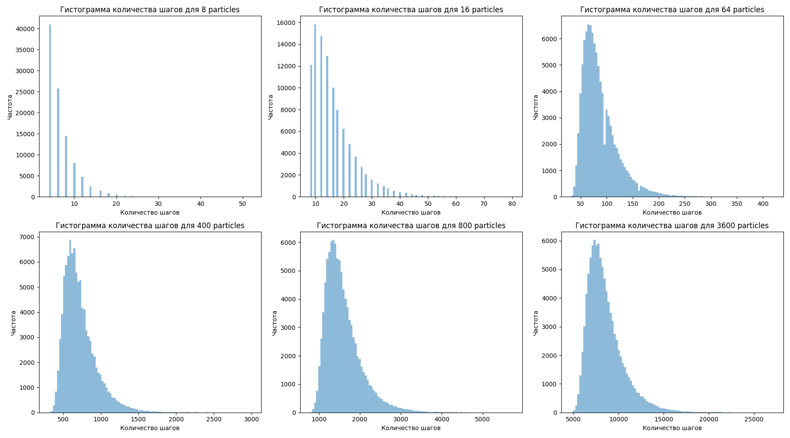

* Зависимость количества частиц на левой стороне от числа шагов

_script_1__8_16_800.png)

_script_1__400_800_3600.png)

### Устойчивая стабильность системы script_1.py

В качестве устойчивого равновесия я выбрал условие при котором текущее значение $\pm 1$ частиц в середине, сохраняется в течение определенного количества итераций.

Устойчивые значения в течение 10 шагов:

* Результаты полученные при проведение эксперимента 1000 раз

| Количество частиц | Среднее значение количество шагов | Доверительный интервал |
|-------------------|-----------------------------------|------------------------|
| 8                 | 23.775                            | 22.953 - 24.705        |
| 16                | 33.343                            | 32.002 - 34.723        |
| 64                | 57.681                            | 55.828 - 59.510        |
| 400               | 158.296                           | 154.764 - 162.073      |
| 800               | 249.423                           | 243.946 - 254.652      |
| 3600              | 708.722                           | 695.545 - 720.859      |

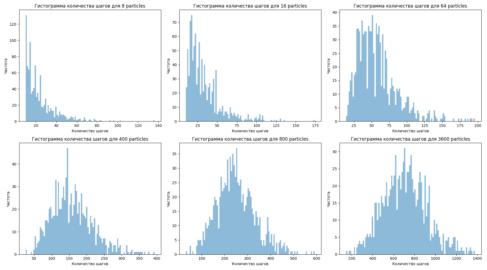

* Результаты полученные при проведение эксперимента 10000 раз

| Количество частиц | Среднее значение количество шагов | Доверительный интервал |
|-------------------|-----------------------------------|------------------------|
| 8                 | 25.167                            | 24.851 - 25.490        |
| 16                | 32.941                            | 32.528 - 33.354        |
| 64                | 57.845                            | 57.271 - 58.431        |
| 400               | 157.871                           | 156.755 - 158.949      |
| 800               | 247.116                           | 245.407 - 248.586      |
| 3600              | 704.959                           | 700.722 - 709.012      |

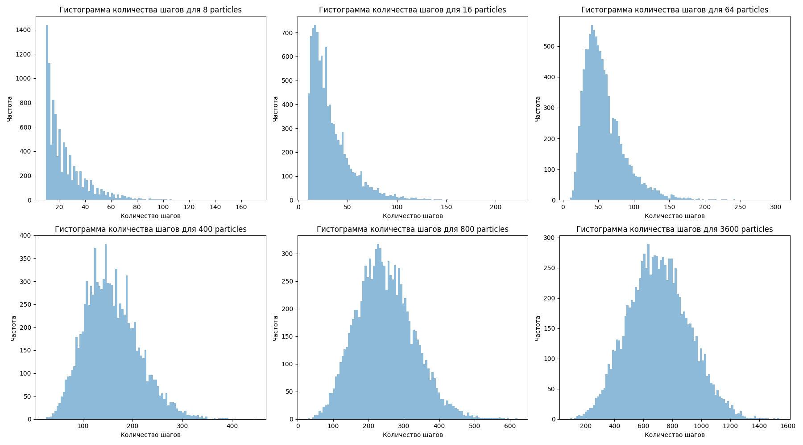

* Результаты полученные при проведение эксперимента 100000 раз

| Количество частиц | Среднее значение количество шагов | Доверительный интервал |
|-------------------|-----------------------------------|------------------------|
| 8                 | 24.968                            | 24.868 - 25.063        |
| 16                | 33.454                            | 33.323 - 33.588        |
| 64                | 57.437                            | 57.256 - 57.602        |
| 400               | 157.823                           | 157.495 - 158.143      |
| 800               | 247.469                           | 246.973 - 247.963      |
| 3600              | 708.290                           | 707.003 - 709.716      |

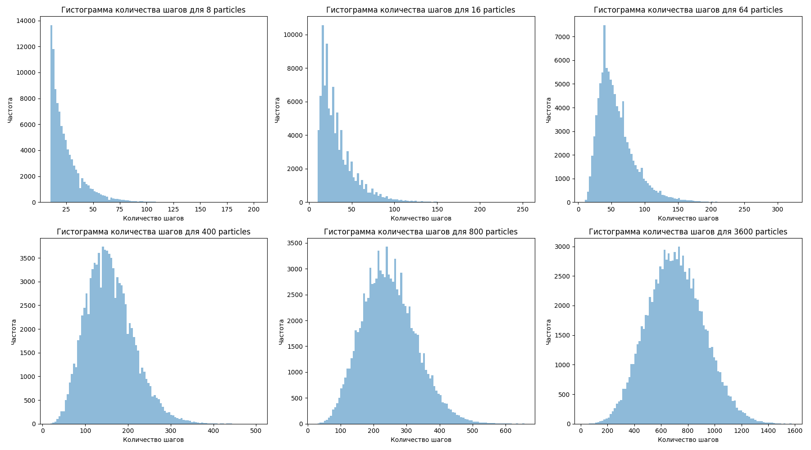

* Зависимость количества частиц на левой стороне от числа шагов

_script_1__8_16_64__10.png)

_script_1__400_800_3600__10.png)

Устойчивые значения в течение 15 шагов:

* Результаты полученные при проведение эксперимента 1000 раз

| Количество частиц | Среднее значение количество шагов | Доверительный интервал |
|--------------------|-----------------------------------|------------------------|
| 8                  | 110.442                           | 104.258 - 116.730      |
| 16                 | 177.069                           | 167.293 - 185.773      |
| 64                 | 262.600                           | 248.714 - 276.149      |
| 400                | 486.056                           | 470.640 - 502.326      |
| 800                | 672.762                           | 654.383 - 690.833      |
| 3600               | 1797.061                          | 1762.107 - 1828.635    |

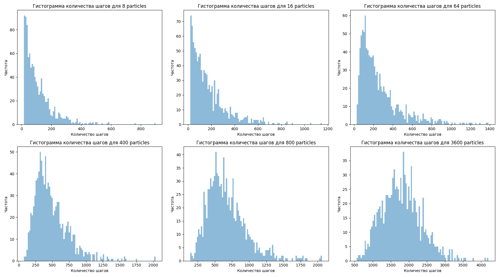

* Результаты полученные при проведение эксперимента 10000 раз

| Количество частиц | Среднее значение количество шагов | Доверительный интервал |
|--------------------|-----------------------------------|------------------------|
| 8                  | 112.414                           | 110.571 - 114.254      |
| 16                 | 180.660                           | 177.493 - 183.825      |
| 64                 | 271.877                           | 267.076 - 276.442      |
| 400                | 480.455                           | 475.434 - 485.596      |
| 800                | 674.393                           | 668.625 - 679.986      |
| 3600               | 1769.564                          | 1758.226 - 1780.481    |

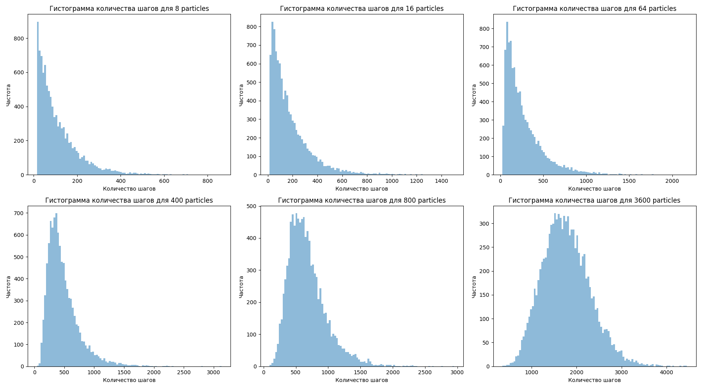

* Результаты полученные при проведение эксперимента 100000 раз

| Количество частиц | Среднее значение количество шагов | Доверительный интервал |
|--------------------|-----------------------------------|------------------------|
| 8                  | 111.197                           | 110.609 - 111.805      |
| 16                 | 176.507                           | 175.534 - 177.425      |
| 64                 | 272.540                           | 271.130 - 273.937      |
| 400                | 478.396                           | 476.686 - 480.056      |
| 800                | 677.996                           | 676.163 - 679.832      |
| 3600               | 1783.281                          | 1779.920 - 1786.522    |

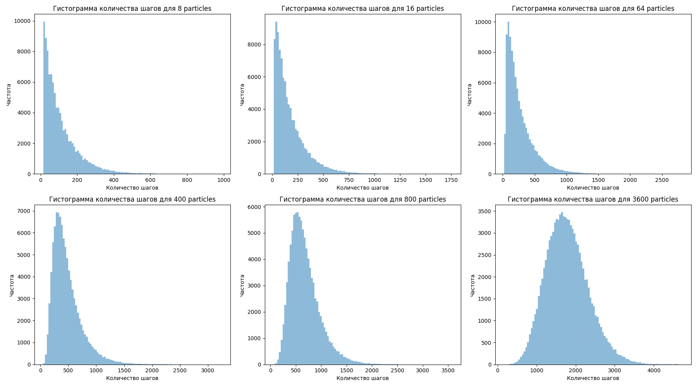

* Зависимость количества частиц на левой стороне от числа шагов

_script_1__8_16_64__15.png)

_script_1__400_800_3600__15.png)

## script_2.py

Реализована та же ситуация но только условие перехода на левую сторону равно $r < p = n/N$ $r$ - случайное число от 0 до 1, $n$ - количество частиц слева $N$ - количество частиц всего.

Спрособы подсчета были точно такие же как и сверху.

### Неустойчивое равновесие системы script_2.py

* Результаты полученные при проведение эксперимента 1000 раз

| Количество частиц | Среднее значение количества шагов | Доверительный интервал |
|--------------------|----------------------------------|------------------------|
| 8                  | 6.706                            | 6.500 - 6.910          |
| 16                 | 15.972                           | 15.564 - 16.446        |
| 64                 | 86.660                           | 84.682 - 88.854        |
| 400                | 708.942                          | 696.039 - 720.847      |
| 800                | 1585.280                         | 1556.176 - 1616.325    |
| 3600               | 8450.474                         | 8334.315 - 8583.542    |
|                    |                                  |                        |

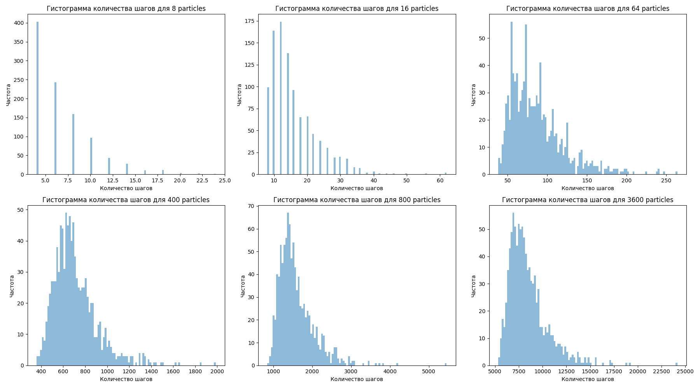

* Результаты полученные при проведение эксперимента 10000 раз

| Количество частиц | Среднее значение количества шагов | Доверительный интервал |
|--------------------|----------------------------------|------------------------|
| 8                  | 6.734                            | 6.663 - 6.800          |
| 16                 | 16.128                           | 15.975 - 16.285        |
| 64                 | 86.812                           | 86.151 - 87.472        |
| 400                | 729.192                          | 724.593 - 733.423      |
| 800                | 1593.832                         | 1585.762 - 1602.295    |
| 3600               | 8501.805                         | 8463.348 - 8542.278    |
|                    |                                  |                        |

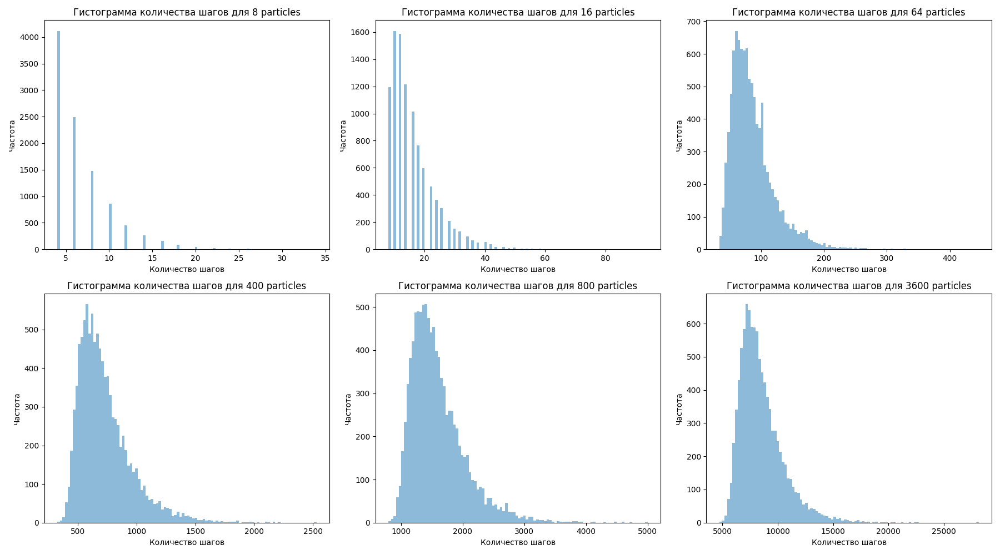

* Результаты полученные при проведение эксперимента 100000 раз

| Количество частиц | Среднее значение количества шагов | Доверительный интервал |
|--------------------|----------------------------------|------------------------|
| 8                  | 6.698                            | 6.677 - 6.720          |
| 16                 | 16.173                           | 16.124 - 16.219        |
| 64                 | 86.846                           | 86.645 - 87.051        |
| 400                | 726.009                          | 724.654 - 727.334      |
| 800                | 1591.952                         | 1589.185 - 1594.846    |
| 3600               | 8510.833                         | 8498.140 - 8523.625    |
|                    |                                  |                        |

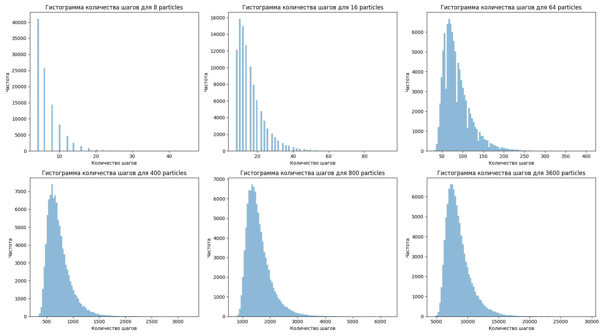

* Зависимость количества частиц на левой стороне от числа шагов

_script_2__8_16_64.png)

_script_2__400_800_3600.png)

 

### Устойчивая стабильность системы script_2.py

Устойчивые значения в течение 10 шагов:

* Результаты полученные при проведение эксперимента 1000 раз

| Количество частиц | Среднее значение количества шагов | Доверительный интервал |
|--------------------|----------------------------------|------------------------|
| 8                  | 25.785                            | 24.835 - 26.772        |
| 16                 | 32.622                            | 31.380 - 33.844        |
| 64                 | 56.027                            | 54.329 - 57.649        |
| 400                | 158.465                           | 155.017 - 161.988      |
| 800                | 245.414                           | 240.437 - 250.254      |
| 3600               | 700.736                           | 687.040 - 713.917      |
|                    |                                  |                        |

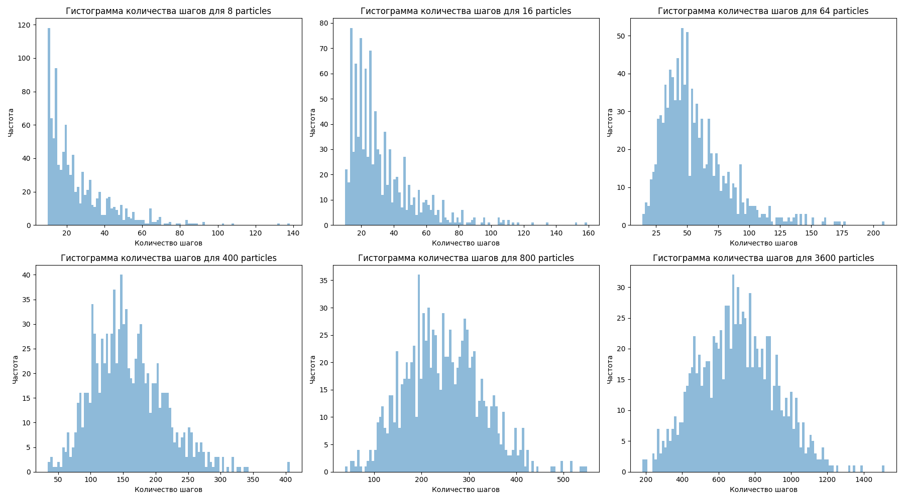

* Результаты полученные при проведение эксперимента 10000 раз

| Количество частиц | Среднее значение количества шагов | Доверительный интервал |
|--------------------|----------------------------------|------------------------|
| 8                  | 25.217                            | 24.914 - 25.514        |
| 16                 | 33.248                            | 32.845 - 33.669        |
| 64                 | 57.796                            | 57.240 - 58.327        |
| 400                | 158.395                           | 157.298 - 159.542      |
| 800                | 248.714                           | 247.187 - 250.255      |
| 3600               | 712.992                           | 709.052 - 717.332      |
|                    |                                  |                        |

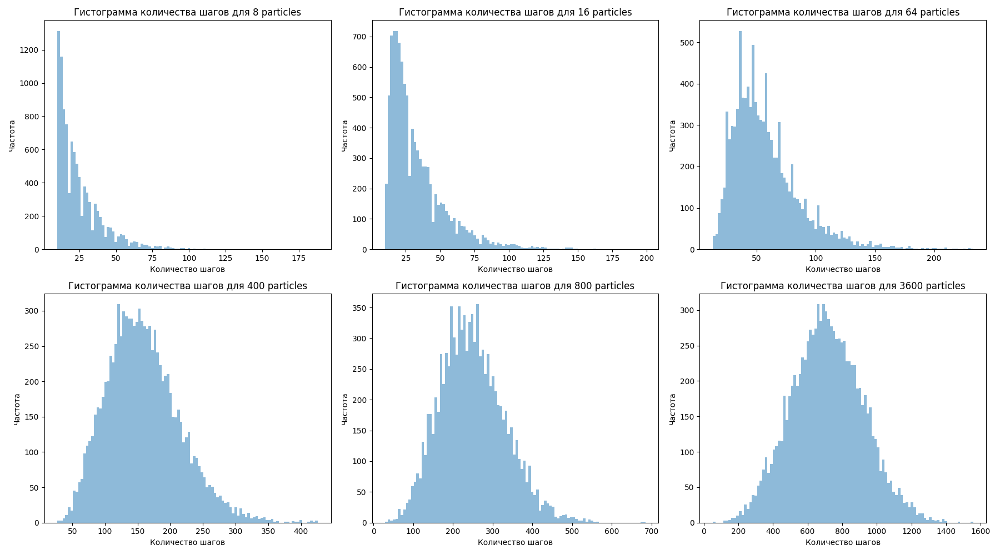

* Результаты полученные при проведение эксперимента 100000 раз

| Количество частиц | Среднее значение количества шагов | Доверительный интервал |
|--------------------|----------------------------------|------------------------|
| 8                  | 25.103                            | 24.999 - 25.202        |
| 16                 | 33.472                            | 33.343 - 33.600        |
| 64                 | 57.550                            | 57.384 - 57.720        |
| 400                | 157.435                           | 157.097 - 157.793      |
| 800                | 247.883                           | 247.373 - 248.359      |
| 3600               | 707.682                           | 706.376 - 709.029      |
|                    |                                  |                        |

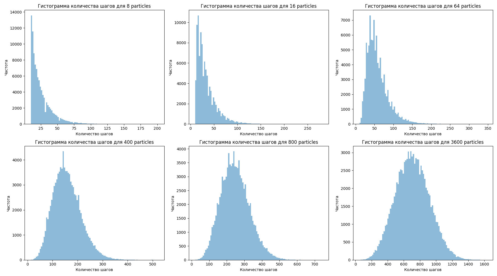

* Зависимость количества частиц на левой стороне от числа шагов

_script_2__8_16_64.png)

_script_2__400_800_3600.png)

Устойчивые значения в течение 15 шагов:

* Результаты полученные при проведение эксперимента 1000 раз

| Количество частиц | Среднее значение количества шагов | Доверительный интервал |
|--------------------|----------------------------------|------------------------|
| 8                  | 25.103                            | 24.999 - 25.202        |
| 16                 | 33.472                            | 33.343 - 33.600        |
| 64                 | 57.550                            | 57.384 - 57.720        |
| 400                | 157.435                           | 157.097 - 157.793      |
| 800                | 247.883                           | 247.373 - 248.359      |
| 3600               | 707.682                           | 706.376 - 709.029      |

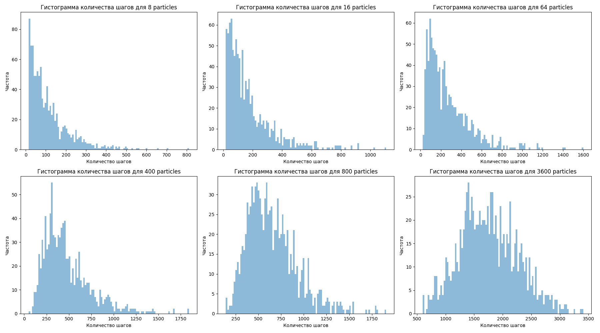

* Результаты полученные при проведение эксперимента 10000 раз

| Количество частиц | Среднее значение количества шагов | Доверительный интервал |
|--------------------|----------------------------------|------------------------|
| 8                  | 116.396                           | 109.875 - 123.010      |
| 16                 | 174.966                           | 164.803 - 185.292      |
| 64                 | 271.427                           | 258.195 - 284.910      |
| 400                | 477.228                           | 460.767 - 492.806      |
| 800                | 651.319                           | 635.094 - 668.285      |
| 3600               | 1754.751                          | 1726.086 - 1786.893    |

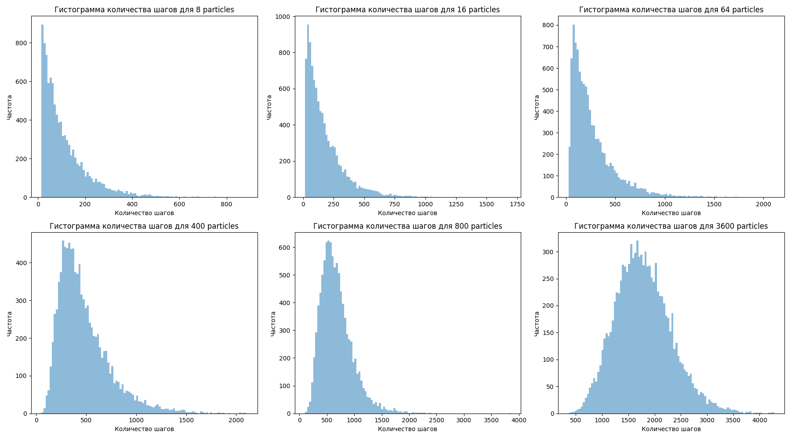

* Результаты полученные при проведение эксперимента 100000 раз

| Количество частиц | Среднее значение количества шагов | Доверительный интервал |
|--------------------|----------------------------------|------------------------|
| 8                  | 113.057                           | 111.211 - 115.046      |
| 16                 | 177.434                           | 174.231 - 180.531      |
| 64                 | 269.762                           | 265.566 - 274.144      |
| 400                | 478.808                           | 473.773 - 483.999      |
| 800                | 678.350                           | 672.682 - 684.334      |
| 3600               | 1785.080                          | 1774.862 - 1796.736    |

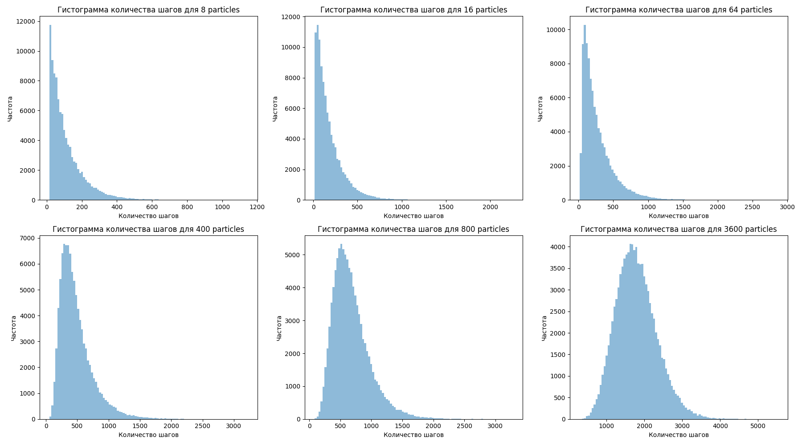

* Зависимость количества частиц на левой стороне от числа шагов

_script_2__8_16_64.png)

_script_2__400_800_3600.png)

### Вывод script_2.py

* Система не сможет достичь постоянного устойчивого равновесия, только при условии, что устойчивость сохраняется на протяжение нескольких итераций, без погрешности в данной модели.

* При увеличение частиц, увеличивается и необходимое количество итераций. 

* Среднее количество шагов для достижения равновесия (при 100000 эксперименте):
    | Количество частиц | Неусточивого равновесия | Стабильного равновесия в 10 шагов  | Стабильного равновесия в 15 шагов |
    |-------------------|-------------------------|------------------------|------------------------|
    |8| 7 | 24 - 25 | 110 - 111 |
    |16| 15 - 16 | 33 - 34 | 175 - 177 |
    |64| 86-87 | 57 - 58 | 271 - 273 |
    |400| 724-726 | 157 - 158 | 476 - 480 |
    |800| 1586-1591 | 246 - 247 | 676 - 679 |
    |3600| 8514-8537 | 707 - 709 | 1779 - 1786 |
    

### Устойчивое равновесие системы script_1.py и script_2.py

Устойчивое рановесие системы в данной модели невозможно, так как каждый раз частица обязана перескочить через отверстие. Если взять погрешность от среднего значения частиц, то устойчивость можно достигнуть, но учитывая, что за итерацию проходит одна случайная частица - устойчивость при значительном количестве частиц будет досигнута при первых итерациях. 
Если брать состояние системы $\pm$ 1 частица, потребуется очень большое количество мощностей, для получение огромного количества датасета. Если взять малое количество экспериментов, аппроксимайия данных будет достаточно слабой.

### Вывод script_1.py script_2.py

<!-- * Получена нелинейная зависимось шагов от количества частиц -->

* При изенение условия перехода частицы - увеличилось необходимое количество итераций для стабильности системы и неусточивого равновесия

* Система не сможет достичь постоянного устойчивого равновесия, только при условии, что устойчивость сохраняется на протяжение нескольких итераций, без погрешности в данной модели.

* При увеличение частиц, увеличивается и необходимое количество итераций(числа шагов). Так как требуется большее количество итераций

* Были получены результаты для достижения среднего количества шагов, в зависимости от числа частица
    
